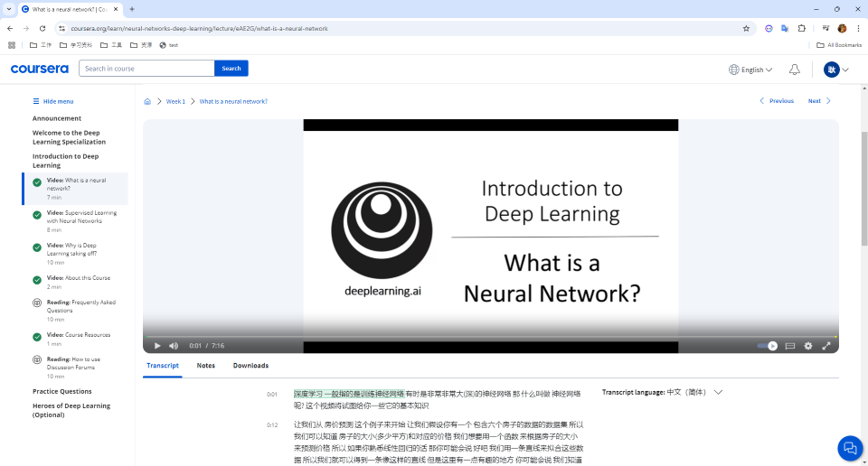
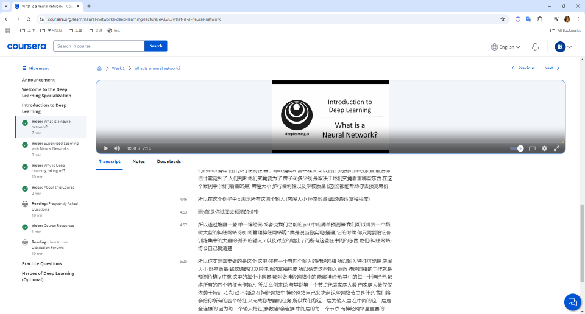
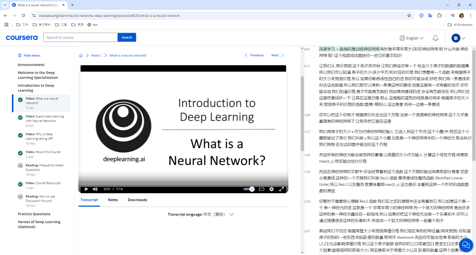

# Coursera Layout Adjustment Script

### 1. Current Coursera Layout

Coursera's learning page presents the video and subtitles in a vertical layout.

As the text scrolls down, the video area becomes significantly smaller, making it inconvenient to view the complete text while keeping an eye on the video. 

Additionally, the screen's side margins are underutilized, leaving wasted space on either side of the content.

### 2. Improved Layout with this Script

This script modifies the layout, changing it to a horizontal split. The video remains at an acceptable size, while the text section is displayed more fully. Scrolling through the text will no longer shrink the video, providing a more convenient and productive viewing experience.

### 3. How to Use

To apply this layout modification:

1. Open the browser's developer console (typically by pressing F12 or Ctrl+Shift+I).
2. Paste the provided JavaScript code into the console.
3. Press Enter to execute the script.

This will immediately update the page layout, providing a more user-friendly interface for Coursera courses.